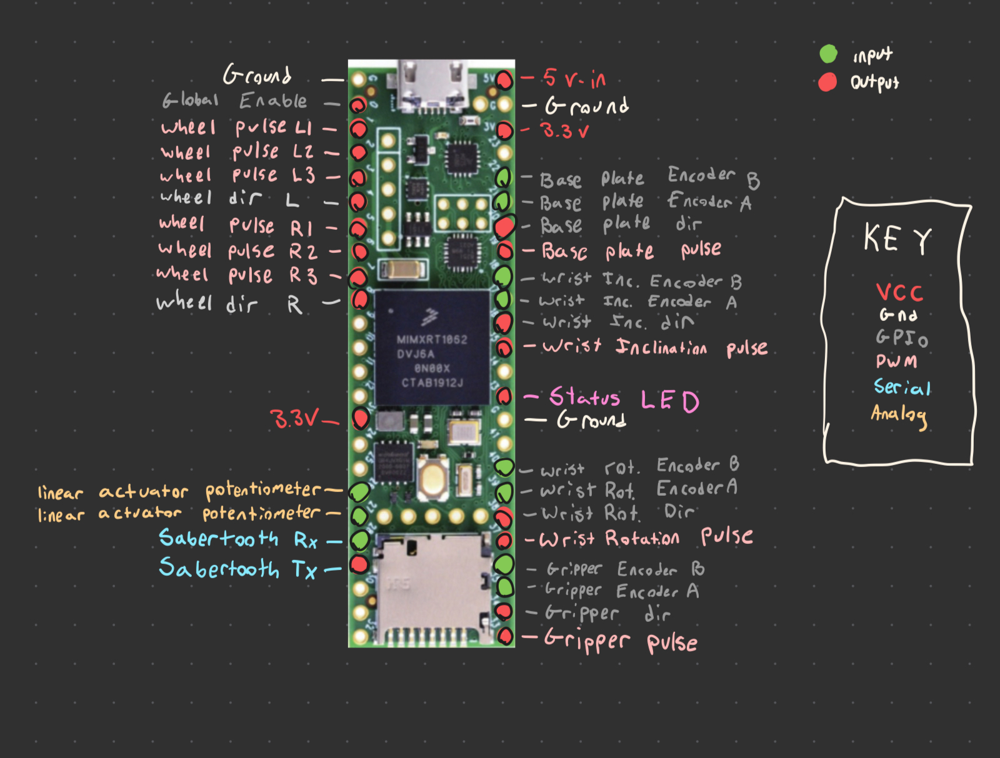

# Rover Embedded Software

## Table of Contents

- [About](#about)
- [Getting Started](#getting_started)
- [Usage](#usage)
- [Contributing](../CONTRIBUTING.md)

## About 

This is an adaptation of the ros_arduino_bridge designed specifically for the Teensy 4.1. We use almost entirely custom hardware so all encoder and motor controller comms are done directly through the board.

Our pinout setup can be easily viewed in the `pinout.h` header file inside the `include/` dir

## Getting Started 

This code is for the PJRC Teensy 4.1 development board. These instructions are to get it flashed onto the microcontroller.

### Prerequisites

- VS Code Installed
- [PlatformIO](https://platformio.org/platformio-ide) Installed
- Teensy 4.1 microcontroller plugged into USB

`sudo apt install teensy-loader-cli python3-venv`

### Installing

1. Clone the repository
2. Open the cloned folder in VS Code
3. Upload software to board using the PlatformIO plugin

### Troubleshooting

Make sure that the serial monitor is configured to the correct baud rate (9600) and that the line ending is set to "CR"

## Roadmap

- [x] Brushless motor control
- [x] Custom pinout
- [x] Sequential encoder support
- [x] Stepper motor control
    - [x] Speed control
- [ ] Linear actuator control
    - [ ] actuator angle calculation
- [ ] Hardware addressing
- [ ] Unit testing
    - [ ] QEMU hardware simulation
- [ ] Independent wheel motor control
- [ ] PID position control
- [ ] PID velocity control
- [ ] ROS integration

## Pin assignment chart

